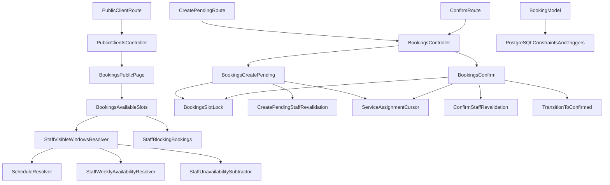

# Booking Domain Map

## Objectif

Donner une vue technique compacte des couches runtime booking, des couplages critiques et des points de risque.

## Vue d'ensemble

## Coupling points critiques

1. **Disponibilite vs confirmation**
   - `Bookings::AvailableSlots` et `CreatePendingStaffRevalidation` doivent rester coherents.
2. **Concurrence**
   - `Bookings::SlotLock` + exclusion constraint DB (`confirmed` overlaps).
3. **Lifecycle**
   - `Booking` enum/validations + checks DB + `TransitionToConfirmed`.
4. **Round-robin**
   - `ServiceAssignmentCursor` lu en create-pending, ecrit en confirm.
5. **Token pending**
   - `PublicPendingTokenResolver` + `ExpiredBookingLink` + trigger global uniqueness.

## Frontieres de responsabilite

- Controllers: orchestration HTTP + redirections.
- Services booking: logique metier et revalidation.
- Models: validations locales et associations.
- PostgreSQL: garde-fous d'integrite forts (checks, triggers, exclusion constraints).
- Tests: preuve de non-regression cross-layer.

## Authz matrix (runtime actuel)

| Surface | Anonymous | user | client_user | admin |
| --- | --- | --- | --- | --- |
| `GET /:slug` | allowed | allowed | allowed | allowed |
| `POST /:slug/services/:service_id/bookings` | allowed | allowed | allowed | allowed |
| `GET /:slug/bookings/:token` | allowed (token capability) | allowed (token capability) | allowed (token capability, with client context guard) | allowed (token capability) |
| `POST /:slug/bookings/:token/confirm` | allowed (token capability) | allowed (token capability) | allowed (token capability, with client context guard) | allowed (token capability) |
| `/admin/*` | denied | denied | denied | allowed |
| `/client/*` | denied | denied | allowed | denied |
| `/user/*` | denied | allowed | denied | denied |

## Payment integration seam (design readiness)

- Current runtime keeps booking confirmation independent from payment.
- `booking_status = failed` remains reserved for future payment outcomes only.
- Recommended seam for future integration:
  1. create `PaymentSession` orchestration service
  2. keep reservation lock and payment confirmation separated
  3. introduce explicit transition gateway from payment result to booking terminal status
  4. preserve current `pending -> confirmed` non-payment path unless payment is enabled

## Thin-controller guardrails

- Keep controllers limited to:
  - request parsing
  - authorization and context loading
  - service orchestration
  - render/redirect decisions
- Move wizard validations and persistence assembly into dedicated support objects under `app/services/`.
- Any controller method exceeding one business responsibility must be extracted before adding new logic.

## Zones a surveiller

- drift entre disponibilite visible et revalidation transactionnelle
- ambiguite auth si docs et runtime divergent
- evolution paiement pouvant polluer lifecycle sans contrat explicite
